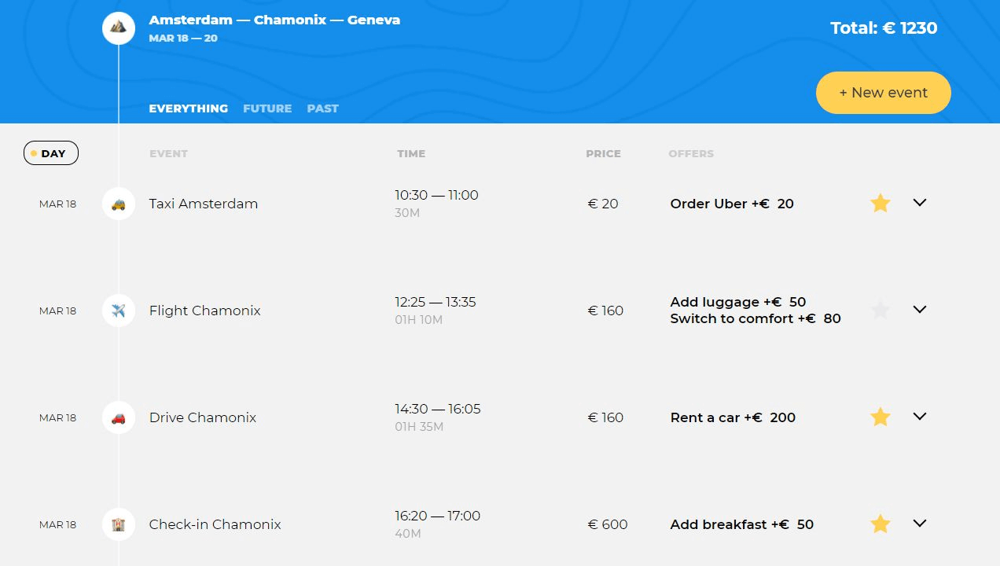

# Учебный проект «Большое путешествие»
- Проект выстроен по паттерну проектирования MVP (Model-View-Presenter).
- Является Single Page Application (SPA).
- Сборка происходит на Webpack.

## О проекте
«Большое путешествие» — современный сервис для настоящих путешественников. Сервис помогает детально спланировать маршрут поездки, рассчитать стоимость путешествия и получить информацию о достопримечательностях. Минималистичный интерфейс не даст повода отвлечься и сфокусирует внимание на планировании путешествия.

## Основные команды
- Установка зависимостей `npm i`.
- Запуск локального сервера для разработки `npm run start`.
- Запуск тестирования на соответствие код-гайдам `npm run test`.
- Сборка проекта `npm run build`.

## Каталоги
- Вся разработка ведется в директории `src/`.
- Разметка, шрифты, стили и изображения находятся в директории `markup/`.

Загрузка данных с сервера https://17.ecmascript.pages.academy/big-trip.
